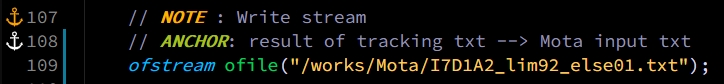

# 프로젝트명
> pig-tracking 최적의 알고리즘을 위한 도구

<!-- [![NPM Version][npm-image]][npm-url]
[![Build Status][travis-image]][travis-url]
[![Downloads Stats][npm-downloads]][npm-url] -->

pig-tracking에 사용하는 거리, iou, cost 등 여러 feature를 조합했을 때
어떤 알고리즘이 가장 좋을지 객관적으로 비교하기 위한 Mota 측정 도구

<!--  -->

## 설치 방법

Docker:

```sh
intflow/edgefarm:v1.2
# or 192.168.0.3
jsh_test:latest
```


## 사용 예제

먼저 pig_tracking에서 tracking 결과를 얻어야 함

* repo : [pig-tracking][pig-tracking]


## 개발 환경 설정

NX 환경에서 구동완료

```sh
Vscode에서 Cmake 관련 툴을 깔고 바로 돌리면 ok
```

## 업데이트 내역

* landmks_3
    * 수정 : 기존의 landmarks 1개에서 3개로 수정 (칼만필터 weight 변경)


## 정보

주소현 – cannonvirus@intflow.ai


<!-- Markdown link & img dfn's -->
[pig-tracking]: https://github.com/cannonvirus/pig_tracking/tree/landmks_3